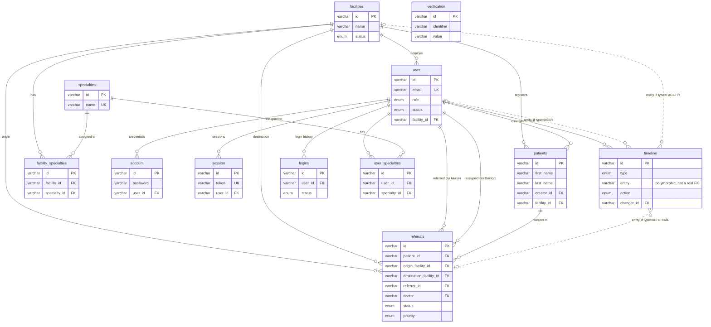

# Database — Tables & Relationships

Reference doc for the schema as it actually exists in
`api/src/drizzle/schema/*.ts` (source of truth — this doc describes,
it doesn't design). MySQL via Drizzle ORM. Every table uses a
`varchar(36)` UUID primary key; timestamped tables follow the same
`created_at` / `updated_at` (`$onUpdate`) pattern throughout.

Regenerate/update this doc whenever a schema file changes shape —
it'll drift otherwise, same risk as any other doc in `docs/`.

## Entity-relationship diagram

The three dotted `timeline` lines aren't a real constraint — see
[Timeline](#timeline-append-only-audit-log) below. Every other line is
an enforced foreign key.

## Tables

### `facilities`

A hospital/clinic. Comes into being only as `PENDING`, paired with its
founding Manager's own sign-up application.

| Column | Type | Notes |
|---|---|---|
| `id` | varchar(36) PK | |
| `name` | varchar(255) | indexed |
| `address` | text | nullable |
| `status` | enum `FACILITY_STATUS` | `PENDING` \| `APPROVED` \| `REJECTED` \| `FLAGGED` \| `SUSPENDED`, indexed |
| `created_at` / `updated_at` | timestamp | |

### `user`

Staff account. `role` and `status` are the two axes the whole
authorization model is built on (see `docs/roles-permissions.md`).

| Column | Type | Notes |
|---|---|---|
| `id` | varchar(36) PK | |
| `name` | varchar(255) | nullable |
| `email` | varchar(255) | unique, indexed |
| `verified` | boolean | default false |
| `image` | varchar(255) | nullable |
| `role` | enum `ROLES` | `NURSE` \| `DOCTOR` \| `ADMINISTRATOR` \| `MANAGER`, indexed |
| `status` | enum `USER_STATUS` | `PENDING` \| `ACTIVE` \| `REJECTED` \| `DISABLED` \| `FLAGGED` \| `DEPARTED` |
| `must_change_password` | boolean | default false — set on admin-created/reset accounts; **not yet enforced anywhere client-side**, see `docs/backlog.md` |
| `facility_id` | varchar(36) FK → `facilities.id` | nullable (orphaned-facility fallback), indexed |
| `created_at` / `updated_at` | timestamp | `updated_at` indexed |

### `account`

better-auth's credential storage — one row per login method per user
(this app only ever creates the `credential` provider, via
`auth.api.signUpEmail`). `password` is the Argon2id hash
(`api/src/lib/password.ts`), never better-auth's default scrypt.

| Column | Type | Notes |
|---|---|---|
| `id` | varchar(36) PK | |
| `password` | varchar(255) | nullable (only set for the credential provider) |
| `account_id` | varchar(255) | provider-specific identifier |
| `provider` | varchar(255) | |
| `user_id` | varchar(36) FK → `user.id`, `onDelete: cascade` | indexed |
| `created_at` / `updated_at` | timestamp | `updated_at` indexed |

### `session`

better-auth's active session tokens.

| Column | Type | Notes |
|---|---|---|
| `id` | varchar(36) PK | |
| `token` | varchar(255) | unique |
| `expires_at` | timestamp | indexed |
| `ip` / `agent` | varchar | nullable |
| `user_id` | varchar(36) FK → `user.id`, `onDelete: cascade` | indexed |
| `created_at` / `updated_at` | timestamp | |

### `verification`

better-auth's generic token store (email verification, etc.). No FK —
`identifier` is a free-form key (e.g. an email address), not a row id.

| Column | Type | Notes |
|---|---|---|
| `id` | varchar(36) PK | |
| `identifier` | varchar(255) | indexed |
| `value` | varchar(255) | |
| `expires_at` | timestamp | |
| `created_at` / `updated_at` | timestamp | |

### `patients`

| Column | Type | Notes |
|---|---|---|
| `id` | varchar(36) PK | |
| `first_name` / `last_name` | varchar(100) | composite index (`last_name, first_name`) |
| `date_of_birth` | date | |
| `gender` | enum `GENDER` | nullable — `MALE` \| `FEMALE` \| `OTHER` |
| `phone` | varchar(20) | nullable |
| `address` | text | nullable |
| `creator_id` | varchar(36) FK → `user.id` | indexed |
| `facility_id` | varchar(36) FK → `facilities.id` | indexed |
| `created_at` / `updated_at` | timestamp | |

Flagged/unflagged status is **not a stored column** — it's a computed
field derived from the most recent `FLAGGED`/`UNFLAGGED` row in
`timeline` (batched lookup, not per-row N+1).

### `referrals`

| Column | Type | Notes |
|---|---|---|
| `id` | varchar(36) PK | |
| `patient_id` | varchar(36) FK → `patients.id` | indexed |
| `origin_facility_id` | varchar(36) FK → `facilities.id` | indexed |
| `destination_facility_id` | varchar(36) FK → `facilities.id` | indexed |
| `visit_reason` / `referral_reason` | text | both required |
| `priority` | enum `PRIORITY` | `low` \| `medium` \| `high` \| `urgent`, default `medium` |
| `status` | enum `REFERRAL_STATUS` | `PENDING` \| `ACCEPTED` \| `IN_PROGRESS` \| `ON_HOLD` \| `COMPLETED` \| `REJECTED` \| `CANCELED`, indexed |
| `referrer_id` | varchar(36) FK → `user.id` | the Nurse who created it, indexed |
| `doctor` | varchar(36) FK → `user.id` | nullable — assigned by a Manager or self-assigned, indexed |
| `created_at` / `updated_at` | timestamp | |

### `timeline` — append-only audit log

Generalized activity log covering User/Facility/Referral
moderation and status history in one shared shape — this is what
powers both the Administrator/Manager audit views and the Manager
facility-audit feed (`docs/roles-permissions.md`).

| Column | Type | Notes |
|---|---|---|
| `id` | varchar(36) PK | |
| `type` | enum `TIMELINE_TYPE` | `USER` \| `FACILITY` \| `REFERRAL` \| `PATIENT` (reserved, unused so far) |
| `entity` | varchar(36) | **polymorphic — not a real FK.** Which table it points at is determined by `type`; a single column can't be DB-constrained against more than one table |
| `action` | enum `TIMELINE_ACTION` | 17 values — `STATUS_CHANGE`, `DOCTOR_ASSIGNED`, `REDIRECTED`, `TRANSFER_REQUESTED`, `TRANSFER_APPROVED_ORIGIN`, `TRANSFER_APPROVED_DESTINATION`, `TRANSFER_REJECTED`, `APPROVED`, `REJECTED`, `DISABLED`, `FLAGGED`, `UNFLAGGED`, `SUSPENDED`, `DEPARTED`, `APPEAL_SUBMITTED`, `APPEAL_APPROVED`, `APPEAL_DENIED` |
| `previous` / `next` | varchar(50) | both nullable — some actions (e.g. `APPEAL_SUBMITTED`) aren't a value transition |
| `changer_id` | varchar(36) FK → `user.id` | who performed the action — always a real FK, a changer is always exactly one person |
| `notes` | text | nullable, free-text reason |
| `changed_at` | timestamp | indexed, alongside `(type, entity)` |

### `logins`

Per-attempt login history (success/failure/lockout), separate from
`session` (which only tracks currently-active sessions).

| Column | Type | Notes |
|---|---|---|
| `id` | varchar(36) PK | |
| `user_id` | varchar(36) FK → `user.id` | indexed |
| `login_at` | timestamp | indexed |
| `logout_at` | timestamp | nullable |
| `ip` | varchar(100) | nullable |
| `device` | text | nullable |
| `status` | enum `LOGIN_STATUS` | `success` \| `failed` \| `locked_out` |
| `reason` | text | nullable |

### `specialties`, `facility_specialties`, `user_specialties`

Reference table (`specialties`) plus two many-to-many join tables, for
tagging a facility or a Doctor/Nurse with clinical specialties
(Cardiology, Orthopedics, etc.).

**Schema and `core/specialty.ts` repository exist; nothing above that
does.** No `management/` business logic, no routes, no frontend —
fully unreachable from any API endpoint today. Tracked as an unscoped
idea in `docs/backlog.md` ("Facility specialties"); this schema is
further along than that backlog entry suggests, but still not wired to
anything.

| Table | Columns beyond `id`/`created_at` |
|---|---|
| `specialties` | `name` (unique, indexed) |
| `facility_specialties` | `facility_id` FK, `specialty_id` FK — unique on the pair |
| `user_specialties` | `user_id` FK, `specialty_id` FK — unique on the pair |

## Notes

- **better-auth-owned tables**: `account`, `session`, `verification`
  are better-auth's own schema (customized: `status`/`role`/
  `must_change_password`/`facility_id` added to `user` as
  `additionalFields`). Don't hand-roll auth logic against them directly
  outside `api/src/lib/auth.ts`.
- **No hard deletes anywhere.** Every entity is status-lifecycle-only
  (`PENDING`/`DISABLED`/`DEPARTED`/etc.) — there is no user/facility/
  patient/referral delete path in this system by design.
- **Migrations are collapsed to one file**, regenerated fresh rather
  than accumulated (`[[feedback_migrations_single_file]]`) — don't look
  for historical migration history, there isn't one.
